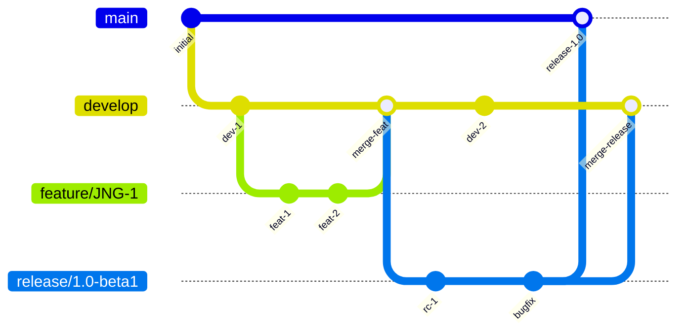
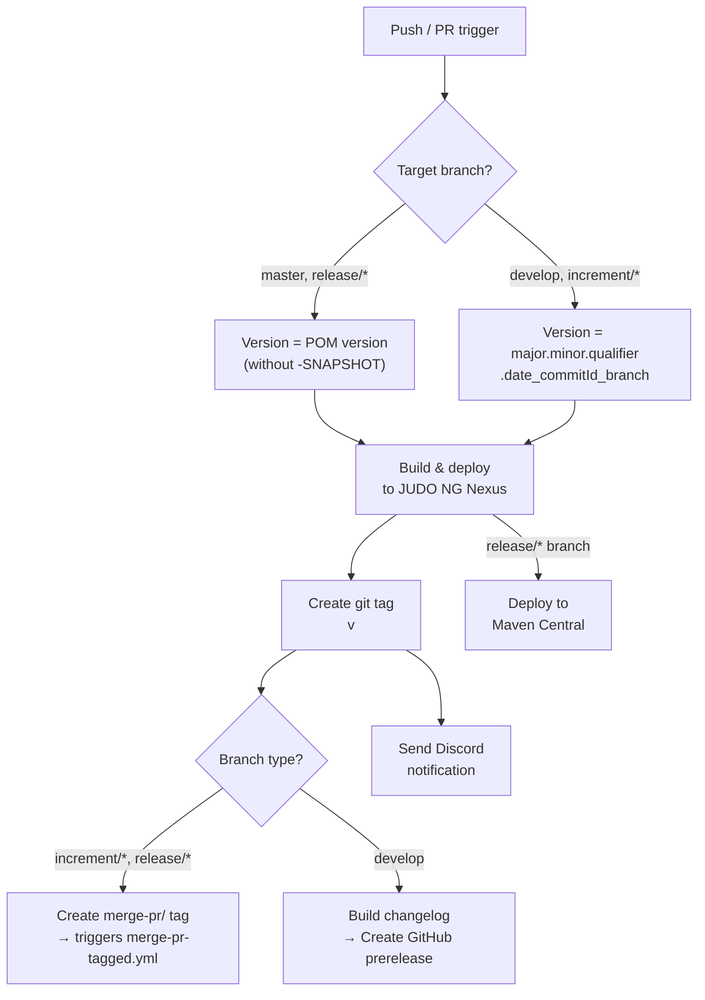
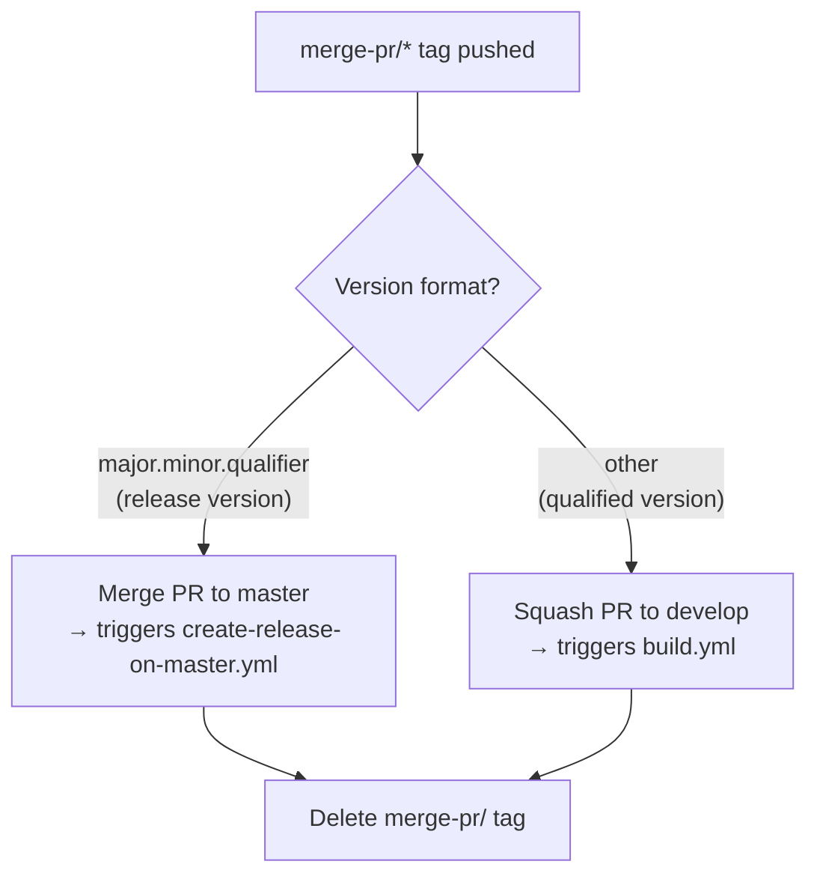
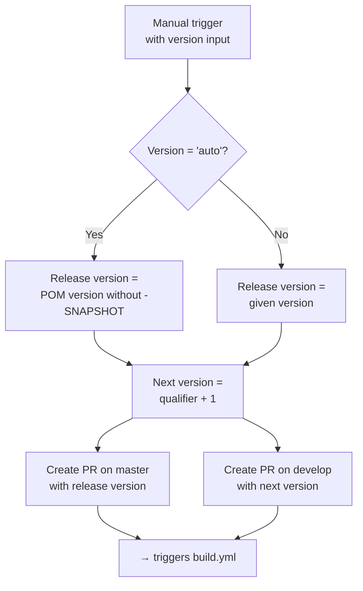

# Development Versioning and Branch Handling

This document describes the branching strategy, version numbering policy, and CI/CD pipeline for the Jasypt Karaf Support project. The workflow is based on [GitFlow](https://www.atlassian.com/git/tutorials/comparing-workflows/gitflow-workflow).

## Branches

The project uses five branch types, each with a specific role in the development lifecycle:

| Branch Pattern | Base | Purpose |
|---|---|---|
| `develop` | — | Main development branch containing the latest sources of the active version |
| `feature/JNG-NUMBER_summary` | `develop` | New features that will be included in the next version |
| `release/VERSION` (e.g. `1.0-beta1`) | `develop` | Release preparation and stabilization |
| `bugfix/JNG-NUMBER_summary` | release branch | Bug fixes applied to a release, then merged forward to newer versions |
| `support/JNG-NUMBER_summary` | release branch | Minor changes for a previous release, merged back to the release branch |
| `master` | — | Latest released sources of the active version |
| `hotfix/JNG-NUMBER_summary` | `master` | Urgent fixes applied to both release and master branches |

## Version Numbers

Version numbers follow semantic versioning (`major.minor.qualifier`) with these rules:

| Event | Version Action |
|---|---|
| Starting a `feature/` branch | No version change |
| Starting a `release/` branch | Increment 2nd number on `develop` |
| Creating a `bugfix/` branch | No version change (fixes applied before release) |
| Creating a `support/` branch | Increment 3rd number |
| Creating a `hotfix/` branch | Increment 4th number |

For non-release branches, the CI pipeline generates a qualified version: `major.minor.qualifier.YYYYMMDD_HHMMSS_<commitId>_<branchName>`.

## GitHub Actions CI/CD Pipeline

The project uses several interconnected GitHub Actions workflows. The main build pipeline triggers on pushes to `develop` and pull requests targeting `develop`, `master`, `increment/*`, or `release/*`.

### Build Pipeline (`build.yml`)

This is the primary workflow that compiles, tests, and deploys the project:

### Merge PR Pipeline (`merge-pr-tagged.yml`)

Triggered by `merge-pr/*` tags created by the build pipeline:

### Release Pipeline (`release.yml`)

A manually triggered workflow for cutting releases:

### Release on Master (`create-release-on-master.yml`)

Triggered on pushes to `master`, creates a final (non-prerelease) GitHub release with a changelog.

## Development Rules

> **Important:** There is no commit without a ticket number. Every commit and pull request must include a JIRA ticket reference (`JNG-xxx`).

Issue tracking is managed in [JIRA](https://blackbelt.atlassian.net/jira/dashboards).
