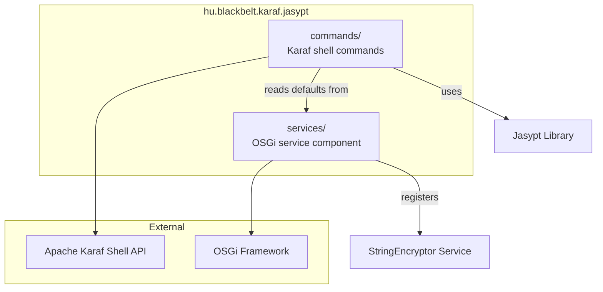

# Contributing to Jasypt Karaf Support

This guide covers how to set up your development environment, understand the project structure, and contribute changes to the Jasypt Karaf Support bundle.

## Development Environment

Before contributing, make sure your environment meets these requirements (see the parent project's [CONTRIBUTING guide](https://github.com/BlackBeltTechnology/judo-community/blob/develop/CONTRIBUTING.adoc) for full details):

- **Java 11+** JDK (CI runs on JDK 21 via Zulu distribution)
- **Maven 3.x** (or use the included Maven wrapper: `./mvnw`)

## Project Structure

This is a single-module OSGi bundle — there are no Maven submodules. All source code lives under `src/main/java/hu/blackbelt/karaf/jasypt/`.

The project has two packages, each with a distinct responsibility:



| Package | Contents | Purpose |
|---------|----------|---------|
| `services` | `DefaultStringEncryptorConfig` | OSGi Declarative Services component that registers a `StringEncryptor` into the service registry with highest priority. Used by PAX-JDBC for encrypted database passwords. |
| `commands` | `Encrypt`, `Decrypt`, `Digest`, `Info` + completers | Karaf console commands under the `jasypt:` scope for interactive encryption, decryption, digest calculation, and algorithm listing. |

## Build Commands

```bash
# Run tests
./mvnw clean test

# Full build (compile, test, package, install to local repo)
./mvnw clean install
```

## Submission Guidelines

### Submitting an Issue

Before submitting, search the [issue tracker](https://github.com/BlackBeltTechnology/karaf-jasypt-support/issues) — your problem may already be reported or resolved. When filing a bug, include:

- Output of `java -version` and `mvn -version`
- `pom.xml` or `.flattened-pom.xml` (if relevant)
- A minimal reproducible use-case

### Submitting a Pull Request

This project follows [GitHub's standard forking model](https://guides.github.com/activities/forking/). To contribute:

1. Fork the repository
2. Create a feature branch from `develop` following the naming convention: `feature/JNG-XXXX_short_description`
3. Implement your changes
4. Run the full test suite: `./mvnw clean test`
5. Submit a pull request targeting the `develop` branch

> **Important:** Every commit must reference a JIRA ticket number (`JNG-xxxx`). This is a hard requirement — no commit without a ticket number.
